# cmaps

### NEW FEATURES ADDED BY PLUTOSET:
1. More colormaps from [Panoply colorbars[(https://www.giss.nasa.gov/tools/panoply/colorbars/) is now available.
2. Visualization of colormaps is now available. Just pull down the README file and you will see it.
3. changed README format from rst files to md files.

| names                       | colormap                                                                 |
|-----------------------------|--------------------------------------------------------------------------|
| amwg                        | 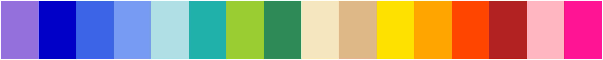                                               
| amwg256                     | 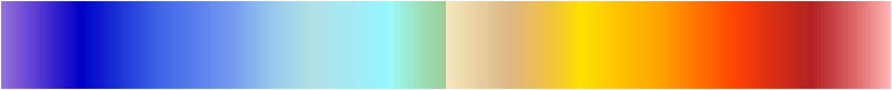                                         
| amwg256_r                   | 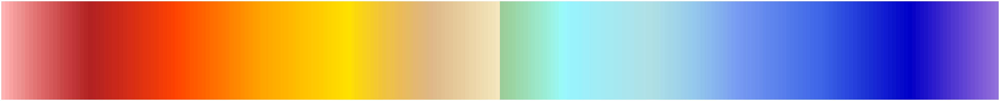                                     
| amwg_blueyellowred          | 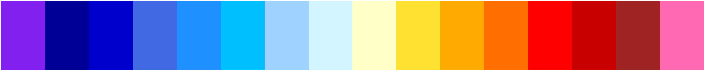                   
| amwg_blueyellowred_r        | 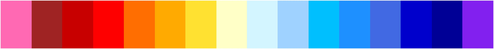               
| amwg_r                      | 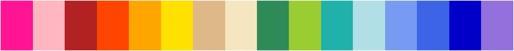                                           
| BkBlAqGrYeOrReViWh200       | 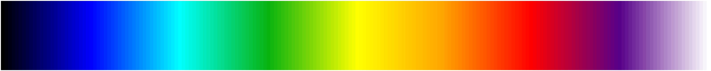             
| BkBlAqGrYeOrReViWh200_r     | 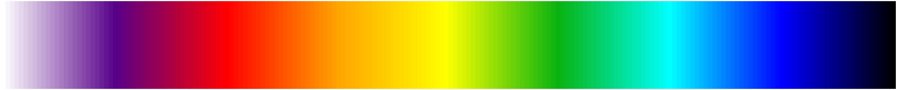         
| BlAqGrWh2YeOrReVi22         | 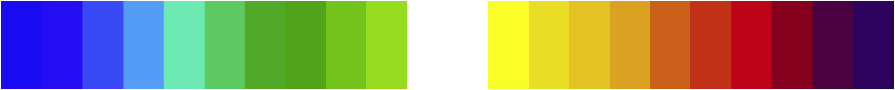                 
| BlAqGrWh2YeOrReVi22_r       | 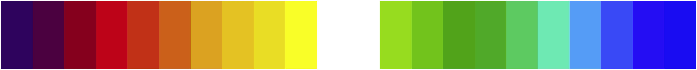             
| BlAqGrYeOrRe                | 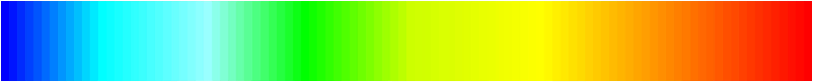                               
| BlAqGrYeOrReVi200           | 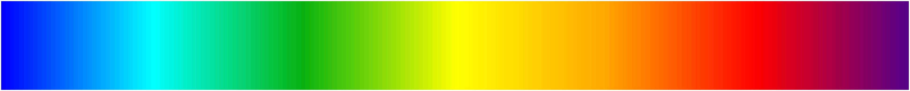                     
| BlAqGrYeOrReVi200_r         | 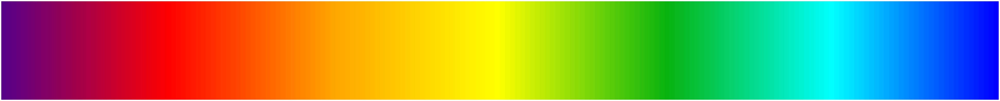                 
| BlAqGrYeOrRe_r              | 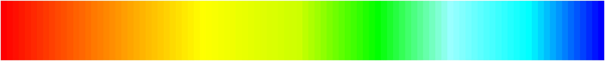                           
| BlGrYeOrReVi200             |                          
| BlGrYeOrReVi200_r           | 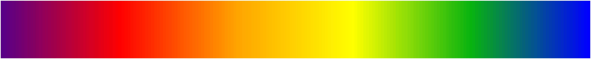                     
| BlRe                        |                                                
| BlRe_r                      |                                            
| BlueDarkOrange18            | 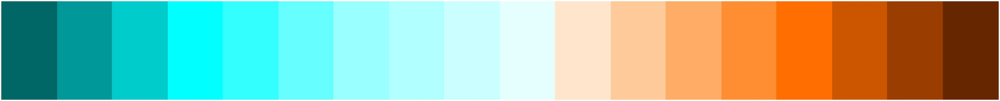                       
| BlueDarkOrange18_r          | 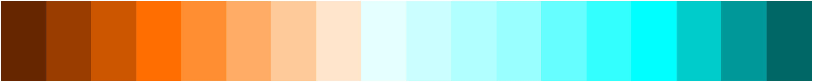                   
| BlueDarkRed18               |                              
| BlueDarkRed18_r             |                          
| BlueGreen14                 |                                  
| BlueGreen14_r               |                              
| BlueRed                     |                                          
| BlueRedGray                 |                                  
| BlueRedGray_r               |                              
| BlueRed_r                   |                                      
| BlueWhiteOrangeRed          |                    
| BlueWhiteOrangeRed_r        |                
| BlueYellowRed               |                              
| BlueYellowRed_r             |                          
| BlWhRe                      |                                            
| BlWhRe_r                    |                                        
| BrownBlue12                 | 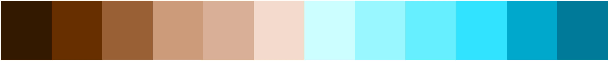                                 
| BrownBlue12_r               | 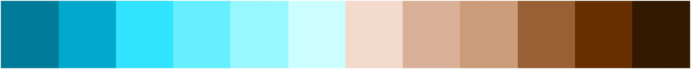                             
| Carbone42                   |                                      
| Carbone42_r                 |                                  
| Cat12                       | 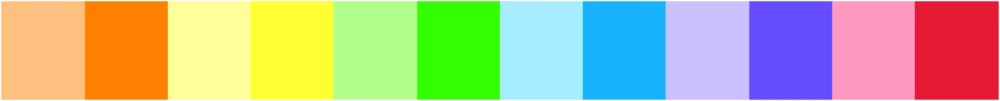                                             
| Cat12_r                     | 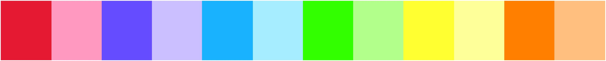                                         
| CBR_coldhot                 |                                  
| CBR_coldhot_r               |                              
| CBR_drywet                  | 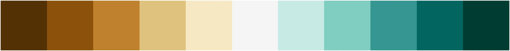                                   
| CBR_drywet_r                | 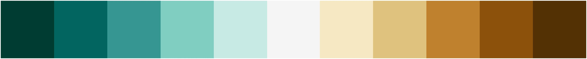                               
| CBR_set3                    | 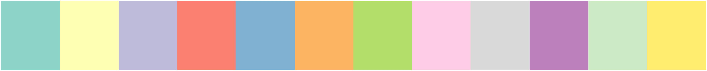                                       
| CBR_set3_r                  | 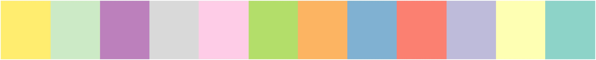                                   
| CBR_wet                     |                                          
| CBR_wet_r                   |                                      
| cb_9step                    | 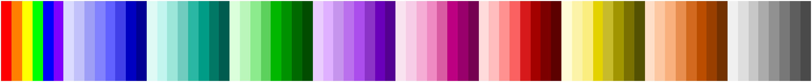                                       
| cb_9step_r                  |                                    
| cb_rainbow                  |                                    
| cb_rainbow_inv              | 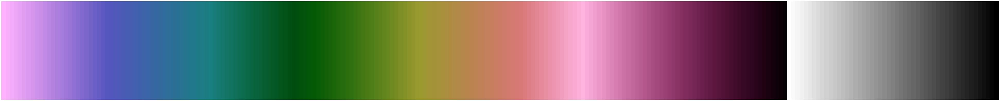                           
| cb_rainbow_inv_r            | 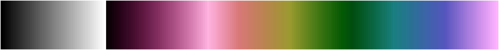                       
| cb_rainbow_r                |                                
| circular_0                  | 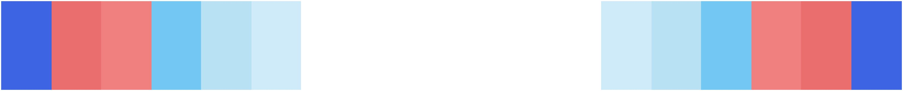                                   
| circular_0_r                |                                
| circular_1                  | 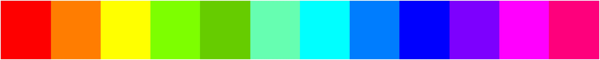                                   
| circular_1_r                | 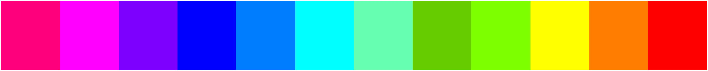                               
| circular_2                  | 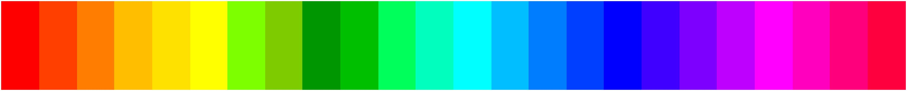                                   
| circular_2_r                | 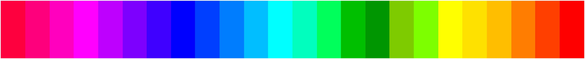                               
| cividis                     |                                          
| cividis_r                   |                                      
| cmaps_rainbow_gray          | 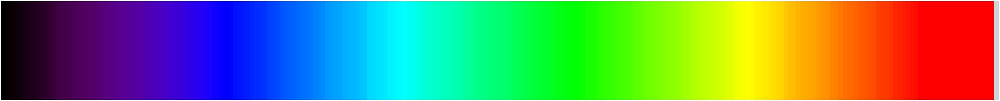                   
| cmaps_rainbow_gray_r        | 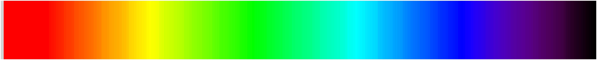               
| cmaps_rainbow_white         | 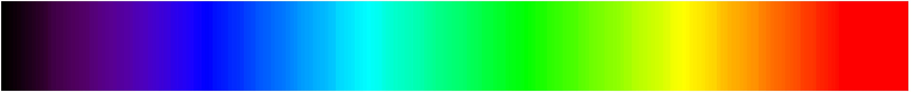                 
| cmaps_rainbow_white_gray    | 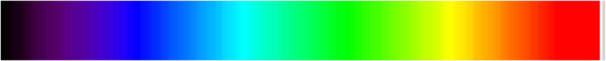       
| cmaps_rainbow_white_gray_r  | 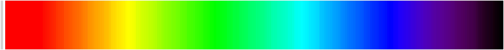   
| cmaps_rainbow_white_r       | 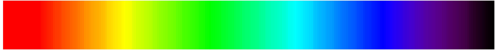             
| cmaps_tbr_240_300           | 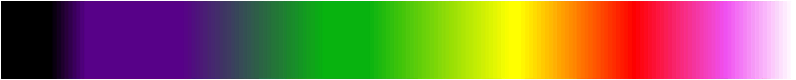                     
| cmaps_tbr_240_300_r         | 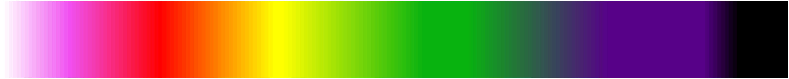                 
| cmaps_tbr_stdev_0_30        |                
| cmaps_tbr_stdev_0_30_r      |            
| cmaps_tbr_var_0_500         | 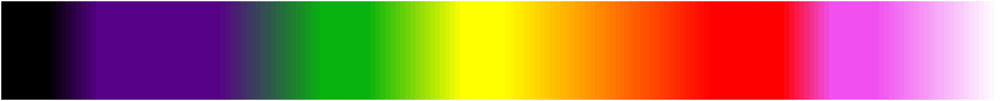                 
| cmaps_tbr_var_0_500_r       | 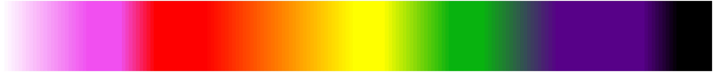             
| cmaps_wh_bl_gr_ye_re        | 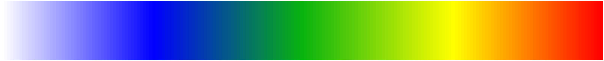               
| cmaps_wh_bl_gr_ye_re_r      | 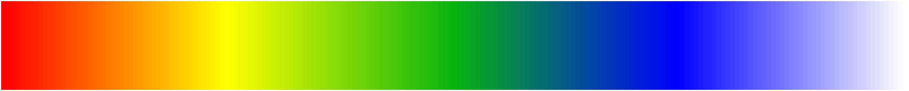           
| cmocean_algae               |                              
| cmocean_algae_r             |                          
| cmocean_amp                 |                                  
| cmocean_amp_r               |                              
| cmocean_balance             |                          
| cmocean_balance_r           |                      
| cmocean_curl                |                                
| cmocean_curl_r              |                            
| cmocean_deep                |                                
| cmocean_deep_r              |                            
| cmocean_delta               |                              
| cmocean_delta_r             |                          
| cmocean_dense               |                              
| cmocean_dense_r             |                          
| cmocean_gray                |                                
| cmocean_gray_r              |                            
| cmocean_haline              |                            
| cmocean_haline_r            |                        
| cmocean_ice                 |                                  
| cmocean_ice_r               |                              
| cmocean_matter              |                            
| cmocean_matter_r            |                        
| cmocean_oxy                 |                                  
| cmocean_oxy_r               |                              
| cmocean_phase               | 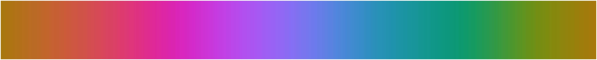                             
| cmocean_phase_r             | 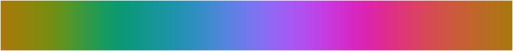                         
| cmocean_solar               |                              
| cmocean_solar_r             |                          
| cmocean_speed               |                              
| cmocean_speed_r             |                          
| cmocean_tempo               |                              
| cmocean_tempo_r             |                          
| cmocean_thermal             |                          
| cmocean_thermal_r           |                      
| cmocean_turbid              |                            
| cmocean_turbid_r            |                        
| cmp_b2r                     | 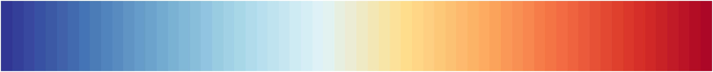                                         
| cmp_b2r_r                   | 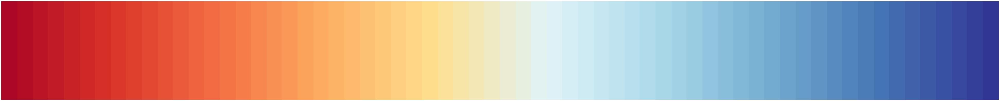                                     
| cmp_flux                    | 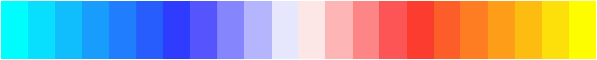                                       
| cmp_flux_r                  |                                    
| cmp_haxby                   |                                      
| cmp_haxby_r                 |                                  
| cosam                       |                                              
| cosam12                     |                                          
| cosam12_r                   |                                      
| cosam_r                     |                                          
| cyclic                      |                                            
| cyclic_r                    |                                        
| default                     |                                          
| default_r                   |                                      
| detail                      |                                            
| detail_r                    |                                        
| drought_severity            |                        
| drought_severity_r          |                    
| EO_aura_omi_formal          |                    
| EO_aura_omi_formal_r        |                
| EO_carbon_density           |                      
| EO_carbon_density_r         |                  
| EO_lightning_lis_otd        |                
| EO_lightning_lis_otd_r      |            
| EO_sargassum_tamo           |                      
| EO_sargassum_tamo_r         |                  
| EO_soil_moist_div           |                      
| EO_soil_moist_div_r         |                  
| EO_temp_anom_4              |                            
| EO_temp_anom_4_r            |                        
| EVL_wind_anom               |                              
| EVL_wind_anom_r             |                          
| example                     |                                          
| example_r                   |                                      
| extrema                     |                                          
| extrema_r                   |                                      
| GHRSST_anomaly              |                            
| GHRSST_anomaly_r            |                        
| GISS_isccp_rainbow          |                    
| GISS_isccp_rainbow_20       |              
| GISS_isccp_rainbow_20_r     |          
| GISS_isccp_rainbow_r        |                
| GMT_cool                    |                                        
| GMT_cool_r                  |                                    
| GMT_copper                  |                                    
| GMT_copper_r                |                                
| GMT_drywet                  |                                    
| GMT_drywet_r                |                                
| GMT_earth                   |                                      
| GMT_earth_r                 |                                  
| GMT_gebco                   |                                      
| GMT_gebco_r                 |                                  
| GMT_globe                   |                                      
| GMT_globe_r                 |                                  
| GMT_gray                    |                                        
| GMT_gray_r                  |                                    
| GMT_haxby                   |                                      
| GMT_haxby_r                 |                                  
| GMT_hot                     |                                          
| GMT_hot_r                   |                                      
| GMT_jet                     |                                          
| GMT_jet_r                   |                                      
| GMT_nighttime               |                              
| GMT_nighttime_r             |                          
| GMT_no_green                |                                
| GMT_no_green_r              |                            
| GMT_ocean                   |                                      
| GMT_ocean_r                 |                                  
| GMT_paired                  |                                    
| GMT_paired_r                |                                
| GMT_panoply                 |                                  
| GMT_panoply_r               |                              
| GMT_polar                   |                                      
| GMT_polar_r                 |                                  
| GMT_red2green               |                              
| GMT_red2green_r             |                          
| GMT_relief                  |                                    
| GMT_relief_oceanonly        |                
| GMT_relief_oceanonly_r      |            
| GMT_relief_r                |                                
| GMT_seis                    |                                        
| GMT_seis_20                 |                                  
| GMT_seis_20_r               |                              
| GMT_seis_r                  |                                    
| GMT_split                   |                                      
| GMT_split_r                 |                                  
| GMT_topo                    |                                        
| GMT_topo_r                  |                                    
| GMT_wysiwyg                 |                                  
| GMT_wysiwygcont             |                          
| GMT_wysiwygcont_r           |                      
| GMT_wysiwyg_r               |                              
| grads_default               |                              
| grads_default_r             |                          
| grads_rainbow               |                              
| grads_rainbow_r             |                          
| GrayWhiteGray               |                              
| GrayWhiteGray_r             |                          
| GreenMagenta16              |                            
| GreenMagenta16_r            |                        
| GreenYellow                 |                                  
| GreenYellow_r               |                              
| gscyclic                    |                                        
| gscyclic_r                  |                                    
| gsdtol                      |                                            
| gsdtol_r                    |                                        
| GSFC_landsat_udf_density    |        
| GSFC_landsat_udf_density_r  |    
| gsltod                      |                                            
| gsltod_r                    |                                        
| gui_default                 |                                  
| gui_default_r               |                              
| helix                       |                                              
| helix1                      |                                            
| helix1_r                    |                                        
| helix_r                     |                                          
| hlu_default                 |                                  
| hlu_default_r               |                              
| hotcold_18lev               |                              
| hotcold_18lev_r             |                          
| hotcolr_19lev               |                              
| hotcolr_19lev_r             |                          
| hotres                      |                                            
| hotres_r                    |                                        
| lithology                   |                                      
| lithology_r                 |                                  
| mask                        |                                                
| mask_r                      |                                            
| matlab_hot                  |                                    
| matlab_hot_r                |                                
| matlab_hsv                  |                                    
| matlab_hsv_r                |                                
| matlab_jet                  |                                    
| matlab_jet_r                |                                
| matlab_lines                |                                
| matlab_lines_r              |                            
| mch_default                 |                                  
| mch_default_r               |                              
| MPL_Accent                  |                                    
| MPL_Accent_r                |                                
| MPL_afmhot                  |                                    
| MPL_afmhot_r                |                                
| MPL_autumn                  |                                    
| MPL_autumn_r                |                                
| MPL_Blues                   |                                      
| MPL_Blues_r                 |                                  
| MPL_bone                    |                                        
| MPL_bone_r                  |                                    
| MPL_BrBG                    |                                        
| MPL_BrBG_r                  |                                    
| MPL_brg                     |                                          
| MPL_brg_r                   |                                      
| MPL_BuGn                    |                                        
| MPL_BuGn_r                  |                                    
| MPL_BuPu                    |                                        
| MPL_BuPu_r                  |                                    
| MPL_bwr                     |                                          
| MPL_bwr_r                   |                                      
| MPL_cool                    |                                        
| MPL_coolwarm                |                                
| MPL_coolwarm_r              |                            
| MPL_cool_r                  |                                    
| MPL_copper                  |                                    
| MPL_copper_r                |                                
| MPL_cubehelix               |                              
| MPL_cubehelix_r             |                          
| MPL_Dark2                   |                                      
| MPL_Dark2_r                 |                                  
| MPL_flag                    |                                        
| MPL_flag_r                  |                                    
| MPL_gist_earth              |                            
| MPL_gist_earth_r            |                        
| MPL_gist_gray               |                              
| MPL_gist_gray_r             |                          
| MPL_gist_heat               |                              
| MPL_gist_heat_r             |                          
| MPL_gist_ncar               |                              
| MPL_gist_ncar_r             |                          
| MPL_gist_rainbow            |                        
| MPL_gist_rainbow_r          |                    
| MPL_gist_stern              |                            
| MPL_gist_stern_r            |                        
| MPL_gist_yarg               |                              
| MPL_gist_yarg_r             |                          
| MPL_GnBu                    |                                        
| MPL_GnBu_r                  |                                    
| MPL_gnuplot                 |                                  
| MPL_gnuplot2                |                                
| MPL_gnuplot2_r              |                            
| MPL_gnuplot_r               |                              
| MPL_Greens                  |                                    
| MPL_Greens_r                |                                
| MPL_Greys                   |                                      
| MPL_Greys_r                 |                                  
| MPL_hot                     |                                          
| MPL_hot_r                   |                                      
| MPL_hsv                     |                                          
| MPL_hsv_r                   |                                      
| MPL_jet                     |                                          
| MPL_jet_r                   |                                      
| MPL_ocean                   |                                      
| MPL_ocean_r                 |                                  
| MPL_Oranges                 |                                  
| MPL_Oranges_r               |                              
| MPL_OrRd                    |                                        
| MPL_OrRd_r                  |                                    
| MPL_Paired                  |                                    
| MPL_Paired_r                |                                
| MPL_Pastel1                 |                                  
| MPL_Pastel1_r               |                              
| MPL_Pastel2                 |                                  
| MPL_Pastel2_r               |                              
| MPL_pink                    |                                        
| MPL_pink_r                  |                                    
| MPL_PiYG                    |                                        
| MPL_PiYG_r                  |                                    
| MPL_PRGn                    |                                        
| MPL_PRGn_r                  |                                    
| MPL_prism                   |                                      
| MPL_prism_r                 |                                  
| MPL_PuBu                    |                                        
| MPL_PuBuGn                  |                                    
| MPL_PuBuGn_r                |                                
| MPL_PuBu_r                  |                                    
| MPL_PuOr                    |                                        
| MPL_PuOr_r                  |                                    
| MPL_PuRd                    |                                        
| MPL_PuRd_r                  |                                    
| MPL_Purples                 |                                  
| MPL_Purples_r               |                              
| MPL_rainbow                 |                                  
| MPL_rainbow_r               |                              
| MPL_RdBu                    |                                        
| MPL_RdBu_r                  |                                    
| MPL_RdGy                    |                                        
| MPL_RdGy_r                  |                                    
| MPL_RdPu                    |                                        
| MPL_RdPu_r                  |                                    
| MPL_RdYlBu                  |                                    
| MPL_RdYlBu_r                |                                
| MPL_RdYlGn                  |                                    
| MPL_RdYlGn_r                |                                
| MPL_Reds                    |                                        
| MPL_Reds_r                  |                                    
| MPL_s3pcpn                  |                                    
| MPL_s3pcpn_l                |                                
| MPL_s3pcpn_l_r              |                            
| MPL_s3pcpn_r                |                                
| MPL_seismic                 |                                  
| MPL_seismic_r               |                              
| MPL_Set1                    |                                        
| MPL_Set1_r                  |                                    
| MPL_Set2                    |                                        
| MPL_Set2_r                  |                                    
| MPL_Set3                    |                                        
| MPL_Set3_r                  |                                    
| MPL_Spectral                |                                
| MPL_Spectral_r              |                            
| MPL_spring                  |                                    
| MPL_spring_r                |                                
| MPL_sstanom                 |                                  
| MPL_sstanom_r               |                              
| MPL_StepSeq                 |                                  
| MPL_StepSeq_r               |                              
| MPL_summer                  |                                    
| MPL_summer_r                |                                
| MPL_terrain                 |                                  
| MPL_terrain_r               |                              
| MPL_viridis                 |                                  
| MPL_viridis_r               |                              
| MPL_winter                  |                                    
| MPL_winter_r                |                                
| MPL_YlGn                    |                                        
| MPL_YlGnBu                  |                                    
| MPL_YlGnBu_r                |                                
| MPL_YlGn_r                  |                                    
| MPL_YlOrBr                  |                                    
| MPL_YlOrBr_r                |                                
| MPL_YlOrRd                  |                                    
| MPL_YlOrRd_r                |                                
| MRO_ice_freq                |                                
| MRO_ice_freq_r              |                            
| N3gauss                     |                                          
| N3gauss_r                   |                                      
| N3saw                       |                                              
| N3saw_r                     |                                          
| NCDC_snow_anom              |                            
| NCDC_snow_anom_r            |                        
| NCDC_temp_anom_f            |                        
| NCDC_temp_anom_f_r          |                    
| ncl_default                 |                                  
| ncl_default_r               |                              
| ncview_default              |                            
| ncview_default_r            |                        
| NCV_banded                  |                                    
| NCV_banded_r                |                                
| NCV_blue_red                |                                
| NCV_blue_red_r              |                            
| NCV_blu_red                 |                                  
| NCV_blu_red_r               |                              
| NCV_bright                  |                                    
| NCV_bright_r                |                                
| NCV_gebco                   |                                      
| NCV_gebco_r                 |                                  
| NCV_jaisnd                  |                                    
| NCV_jaisnd_r                |                                
| NCV_jet                     |                                          
| NCV_jet_r                   |                                      
| NCV_manga                   |                                      
| NCV_manga_r                 |                                  
| NCV_rainbow2                |                                
| NCV_rainbow2_r              |                            
| NCV_roullet                 |                                  
| NCV_roullet_r               |                              
| NEO_albedo_change           |                      
| NEO_albedo_change_r         |                  
| NEO_amsre_ss                |                                
| NEO_amsre_sst_anom          |                    
| NEO_amsre_sst_anom_r        |                
| NEO_amsre_ss_r              |                            
| NEO_aod_diff                |                                
| NEO_aod_diff_r              |                            
| NEO_aquarius_sss            |                        
| NEO_aquarius_sss_r          |                    
| NEO_bright_temp             |                          
| NEO_bright_temp_r           |                      
| NEO_carb_emit_anom          |                    
| NEO_carb_emit_anom_r        |                
| NEO_cdom                    |                                        
| NEO_cdom_r                  |                                    
| NEO_ceres_insol             |                          
| NEO_ceres_insol_r           |                      
| NEO_ceres_lw                |                                
| NEO_ceres_lw_r              |                            
| NEO_ceres_ne                |                                
| NEO_ceres_ne_r              |                            
| NEO_ceres_sw                |                                
| NEO_ceres_sw_r              |                            
| NEO_chlorophyll             |                          
| NEO_chlorophyll_o           |                      
| NEO_chlorophyll_o_r         |                  
| NEO_chlorophyll_r           |                      
| NEO_div_vegetation_         |                  
| NEO_div_vegetation_a        |                
| NEO_div_vegetation_a_r      |            
| NEO_div_vegetation_b        |                
| NEO_div_vegetation_b_r      |            
| NEO_div_vegetation_c        |                
| NEO_div_vegetation_c_r      |            
| NEO_div_vegetation__r       |              
| NEO_evapstress              |                            
| NEO_evapstress_r            |                        
| NEO_gebco_bathymetry        |                
| NEO_gebco_bathymetry_r      |            
| NEO_ggmcf                   |                                      
| NEO_ggmcf_r                 |                                  
| NEO_giss_temp_anom          |                    
| NEO_giss_temp_anom_r        |                
| NEO_grace_lwe_anom          |                    
| NEO_grace_lwe_anom_r        |                
| NEO_grav_anom               |                              
| NEO_grav_anom_r             |                          
| NEO_imperv_surf             |                          
| NEO_imperv_surf_r           |                      
| NEO_meltseason_anom         |                  
| NEO_meltseason_anom_r       |              
| NEO_modis_aer_od            |                        
| NEO_modis_aer_od_r          |                    
| NEO_modis_bs_albedo         |                  
| NEO_modis_bs_albedo_r       |              
| NEO_modis_chlor             |                          
| NEO_modis_chlor_r           |                      
| NEO_modis_cld_ci            |                        
| NEO_modis_cld_ci_r          |                    
| NEO_modis_cld_fr            |                        
| NEO_modis_cld_fr_r          |                    
| NEO_modis_cld_o             |                          
| NEO_modis_cld_o_r           |                      
| NEO_modis_cld_rd            |                        
| NEO_modis_cld_rd_r          |                    
| NEO_modis_cld_wp            |                        
| NEO_modis_cld_wp_r          |                    
| NEO_modis_ls                |                                
| NEO_modis_lst_anom          |                    
| NEO_modis_lst_anom_r        |                
| NEO_modis_ls_r              |                            
| NEO_modis_ndvi              |                            
| NEO_modis_ndvi_r            |                        
| NEO_modis_sky_wv            |                        
| NEO_modis_sky_wv_r          |                    
| NEO_modis_sst_45            |                        
| NEO_modis_sst_45_r          |                    
| NEO_mopitt_co               |                              
| NEO_mopitt_co_r             |                          
| NEO_ns_airtemp              |                            
| NEO_ns_airtemp_r            |                        
| NEO_omi_no2                 |                                  
| NEO_omi_no2_r               |                              
| NEO_omi_ozone_to3           |                      
| NEO_omi_ozone_to3_r         |                  
| NEO_omi_uvi                 |                                  
| NEO_omi_uvi_r               |                              
| NEO_pollution_conc_9        |                
| NEO_pollution_conc_9_r      |            
| NEO_pollution_mor           |                      
| NEO_pollution_mor_r         |                  
| NEO_rainfall_anom_9         |                  
| NEO_rainfall_anom_9_r       |              
| NEO_seasurf_hgt_anom        |                
| NEO_seasurf_hgt_anom_r      |            
| NEO_sedac_pop               |                              
| NEO_sedac_pop_r             |                          
| NEO_snow_water              |                            
| NEO_snow_water_r            |                        
| NEO_soil_moisture           |                      
| NEO_soil_moisture_anom      |            
| NEO_soil_moisture_anom_nl   |      
| NEO_soil_moisture_anom_nl_r |  
| NEO_soil_moisture_anom_r    |        
| NEO_soil_moisture_pale      |            
| NEO_soil_moisture_pale_r    |        
| NEO_soil_moisture_r         |                  
| NEO_srtm_topography         |                  
| NEO_srtm_topography_r       |              
| NEO_tree_cover              |                            
| NEO_tree_cover_r            |                        
| NEO_trmm_rainfall           |                      
| NEO_trmm_rainfall_r         |                  
| NEO_wind_spd_anom           |                      
| NEO_wind_spd_anomaly_pwg    |        
| NEO_wind_spd_anomaly_pwg_r  |    
| NEO_wind_spd_anom_r         |                  
| nice_gfdl                   |                                      
| nice_gfdl_r                 |                                  
| NMCRef                      |                                            
| NMCRef_r                    |                                        
| NMCVel                      |                                            
| NMCVel2                     |                                          
| NMCVel2_r                   |                                      
| NMCVel_r                    |                                        
| NOC_ndvi                    |                                        
| NOC_ndvi_r                  |                                    
| nrl_sirkes                  |                                    
| nrl_sirkes_nowhite          |                    
| nrl_sirkes_nowhite_r        |                
| nrl_sirkes_r                |                                
| NWSRef                      |                                            
| NWSRef_r                    |                                        
| NWSSPW                      |                                            
| NWSSPW_r                    |                                        
| NWSVel                      |                                            
| NWSVel_r                    |                                        
| NYT_drought                 |                                  
| NYT_drought_r               |                              
| OceanLakeLandSnow           |                      
| OceanLakeLandSnow_r         |                  
| perc2_9lev                  |                                    
| perc2_9lev_r                |                                
| percent_11lev               |                              
| percent_11lev_r             |                          
| posneg_1                    |                                        
| posneg_1_r                  |                                    
| posneg_2                    |                                        
| posneg_2_r                  |                                    
| prcp_1                      |                                            
| prcp_1_r                    |                                        
| prcp_2                      |                                            
| prcp_2_r                    |                                        
| prcp_3                      |                                            
| prcp_3_r                    |                                        
| precip2_15lev               |                              
| precip2_15lev_r             |                          
| precip2_17lev               |                              
| precip2_17lev_r             |                          
| precip3_16lev               |                              
| precip3_16lev_r             |                          
| precip4_11lev               |                              
| precip4_11lev_r             |                          
| precip4_diff_19lev          |                    
| precip4_diff_19lev_r        |                
| precip_11lev                |                                
| precip_11lev_r              |                            
| precip_diff_12lev           |                      
| precip_diff_12lev_r         |                  
| precip_diff_1lev            |                        
| precip_diff_1lev_r          |                    
| psgcap                      |                                            
| psgcap_r                    |                                        
| radar                       |                                              
| radar_1                     |                                          
| radar_1_r                   |                                      
| radar_r                     |                                          
| rainbow                     |                                          
| rainbow_r                   |                                      
| rh_19lev                    |                                        
| rh_19lev_r                  |                                    
| seaice_1                    |                                        
| seaice_1_r                  |                                    
| seaice_2                    |                                        
| seaice_2_r                  |                                    
| so4_21                      |                                            
| so4_21_r                    |                                        
| so4_23                      |                                            
| so4_23_r                    |                                        
| spread_15lev                |                                
| spread_15lev_r              |                            
| srip_reanalysis             |                          
| srip_reanalysis_r           |                      
| StepSeq25                   |                                      
| StepSeq25_r                 |                                  
| sunshine_9lev               |                              
| sunshine_9lev_r             |                          
| sunshine_diff_12lev         |                  
| sunshine_diff_12lev_r       |              
| SVG_bhw3_22                 |                                  
| SVG_bhw3_22_r               |                              
| SVG_es_landscape_79         |                  
| SVG_es_landscape_79_r       |              
| SVG_feb_sunrise             |                          
| SVG_feb_sunrise_r           |                      
| SVG_foggy_sunrise           |                      
| SVG_foggy_sunrise_r         |                  
| SVG_fs2006                  |                                    
| SVG_fs2006_r                |                                
| SVG_Gallet13                |                                
| SVG_Gallet13_r              |                            
| SVG_Lindaa06                |                                
| SVG_Lindaa06_r              |                            
| SVG_Lindaa07                |                                
| SVG_Lindaa07_r              |                            
| SVS_soilmoisture            |                        
| SVS_soilmoisture_r          |                    
| SVS_tempanomaly             |                          
| SVS_tempanomaly_r           |                      
| t2m_29lev                   |                                      
| t2m_29lev_r                 |                                  
| tbrAvg1                     |                                          
| tbrAvg1_r                   |                                      
| tbrStd1                     |                                          
| tbrStd1_r                   |                                      
| tbrVar1                     |                                          
| tbrVar1_r                   |                                      
| temp1                       |                                              
| temp1_r                     |                                          
| temp_19lev                  |                                    
| temp_19lev_r                |                                
| temp_diff_18lev             |                          
| temp_diff_18lev_r           |                      
| temp_diff_1lev              |                            
| temp_diff_1lev_r            |                        
| testcmap                    |                                        
| testcmap_r                  |                                    
| thelix                      |                                            
| thelix_r                    |                                        
| TopoGray                    |                                        
| TopoGray_r                  |                                    
| topo_15lev                  |                                    
| topo_15lev_r                |                                
| TwoClass                    |                                        
| TwoClass_r                  |                                    
| UKM_hadcrut                 |                                  
| UKM_hadcrut_10              |                            
| UKM_hadcrut_10_r            |                        
| UKM_hadcrut_r               |                              
| uniform                     |                                          
| uniform_r                   |                                      
| vegetation_ClarkU           |                      
| vegetation_ClarkU_r         |                  
| vegetation_modis            |                        
| vegetation_modis_r          |                    
| ViBlGrWhYeOrRe              |                            
| ViBlGrWhYeOrRe_r            |                                            
| wgne15_r                    |                                        
| WhBlGrYeRe                  |                                    
| WhBlGrYeRe_r                |                                
| WhBlReWh                    |                                        
| WhBlReWh_r                  |                                    
| WhiteBlue                   |                                      
| WhiteBlueGreenYellowRed     |          
| WhiteBlueGreenYellowRed_r   |      
| WhiteBlue_r                 |                                  
| WhiteGreen                  |                                    
| WhiteGreen_r                |                                
| WhiteYellowOrangeRed        |                
| WhiteYellowOrangeRed_r      |            
| WhViBlGrYeOrRe              |                            
| WhViBlGrYeOrReWh            |                        
| WhViBlGrYeOrReWh_r          |                    
| WhViBlGrYeOrRe_r            |                        
| wind_17lev                  |                                    
| wind_17lev_r                |                                
| wxpEnIR                     |                                          
| wxpEnIR_r                   |                                      
---
**original README**

Make it easier to use user defined colormaps in matplotlib. Default
colormaps are from
[NCL](http://www.ncl.ucar.edu/Document/Graphics/color_table_gallery.shtml)
website.

Users can define a environmental variable CMAP_DIR pointing to the
folder containing the self-defined rgb files.

Special thanks to Dr. [Shen](https://github.com/wqshen): for suggestions
and the help of uploading this package to Pypi and anaconda cloud.

If you find my project helpful and would like to support my work with a
small contribution (with
[Paypal](https://paypal.me/hhuangwx?country.x=C2&locale.x=zh_XC)), I
would greatly appreciate it.

如果您觉得我的项目对您有所帮助，可以给我买杯奶茶！

Installation:

    pip install cmaps

or:

    conda install -c conda-forge cmaps

or:

    git clone https://github.com/hhuangwx/cmaps.git
    cd cmaps
    python setup.py install

Usage:

    import matplotlib.pyplot as plt
    import cmaps
    import numpy as np

    x = y = np.arange(-3.0, 3.01, 0.05)
    X, Y = np.meshgrid(x, y)

    sigmax = sigmay = 1.0
    mux = muy = sigmaxy=0.0

    Xmu = X-mux
    Ymu = Y-muy

    rho = sigmaxy/(sigmax*sigmay)
    z = Xmu**2/sigmax**2 + Ymu**2/sigmay**2 - 2*rho*Xmu*Ymu/(sigmax*sigmay)
    denom = 2*np.pi*sigmax*sigmay*np.sqrt(1-rho**2)
    Z = np.exp(-z/(2*(1-rho**2))) / denom

    plt.pcolormesh(X,Y,Z,cmap=cmaps.WhiteBlueGreenYellowRed)
    plt.colorbar()

List the colormaps using the code in the examples:

    import cmaps
    import numpy as np
    import inspect

    import matplotlib.pyplot as plt
    import matplotlib
    matplotlib.rc('text', usetex=False)

    def list_cmaps():
        attributes = inspect.getmembers(cmaps, lambda _: not (inspect.isroutine(_)))
        colors = [_[0] for _ in attributes if
                  not (_[0].startswith('__') and _[0].endswith('__'))]
        return colors

    if __name__ == '__main__':
        color = list_cmaps()

        a = np.outer(np.arange(0, 1, 0.001), np.ones(10))
        plt.figure(figsize=(20, 20))
        plt.subplots_adjust(top=0.95, bottom=0.05, left=0.01, right=0.99)
        ncmaps = len(color)
        nrows = 8
        for i, k in enumerate(color):
            plt.subplot(nrows, ncmaps // nrows + 1, i + 1)
            plt.axis('off')
            plt.imshow(a, aspect='auto', cmap=getattr(cmaps, k), origin='lower')
            plt.title(k, rotation=90, fontsize=10)
            plt.title(k, fontsize=10)
        plt.savefig('colormaps.png', dpi=300)
        plt.close()

New features:

1.  \"Slicing\" function like list or numpy array is supported for
    cmaps:

        cmaps.amwg256[20:-20:2]
        cmaps.amwg256[-20:20:-2]

2.  \"add\" function for the cmaps are supported now:

        cmaps.amwg256+WhiteBlueGreenYellowRed

3.  a cmap can now be interpolated (different from the \"resampled\"
    function in the new version of matplotlib which only takes the
    nearest ones):

        cmaps.amwg256.interp(50)
        cmaps.amwg256.interp(1000)

4.  a cmap can now be convert to LinearSegmentedColormap with different
    numbers of colors, with part of effect similar to interpolation:

        cmaps.amwg256.to_seg(N=100)
